# 科沃斯ERP系统 - 完整业务流程图

> 本文档详细描述用户在ERP系统和账款管理系统中的完整操作流程，以及系统各模块之间的数据联动关系。

---

## 一、基础数据准备（系统初始化）

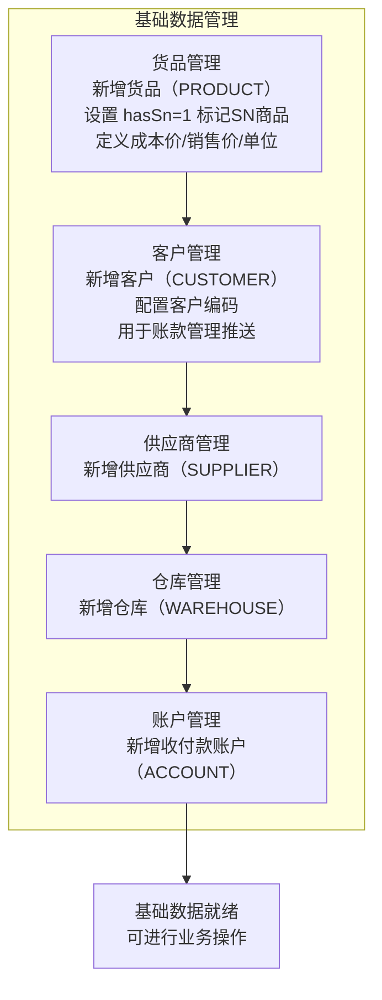

---

## 二、SN码全生命周期状态机

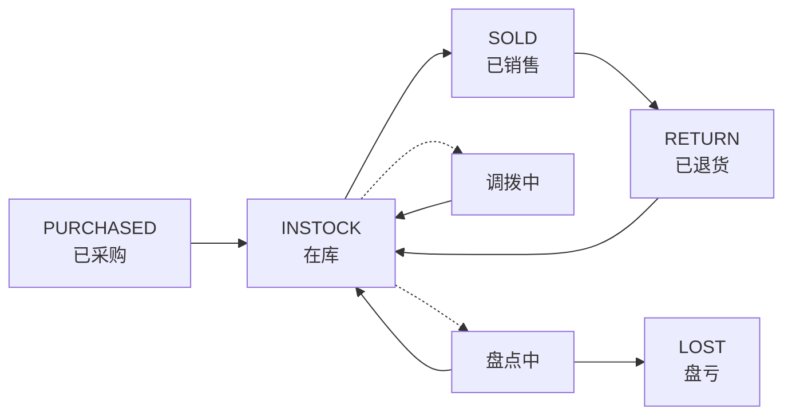

---

## 三、采购管理流程

### 3.1 采购入库

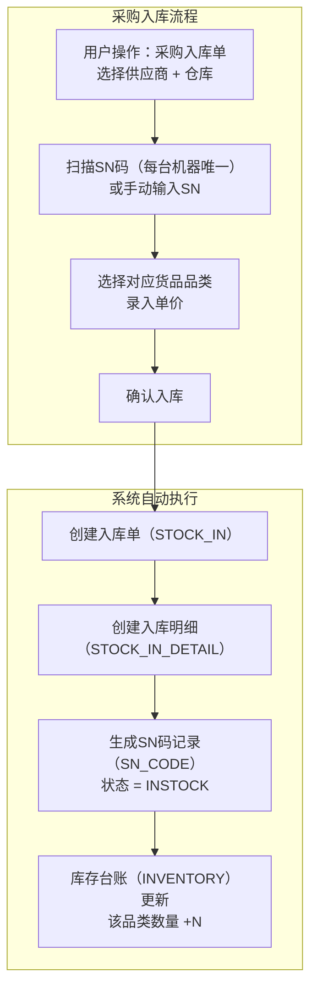

### 3.2 采购付款

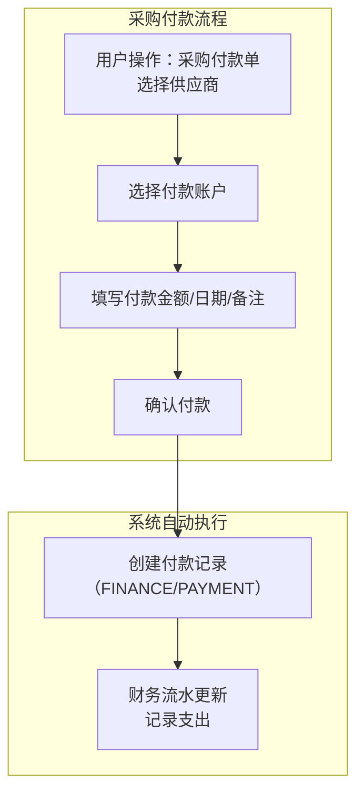

### 3.3 采购退货

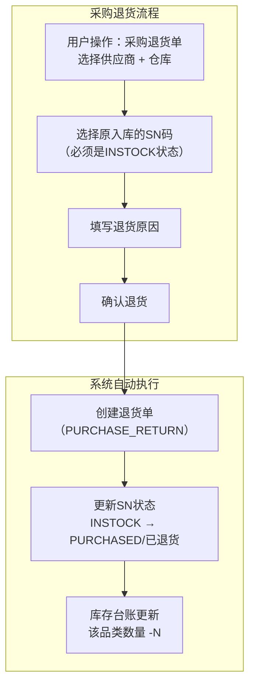

---

## 四、销售管理流程

### 4.1 销售订单

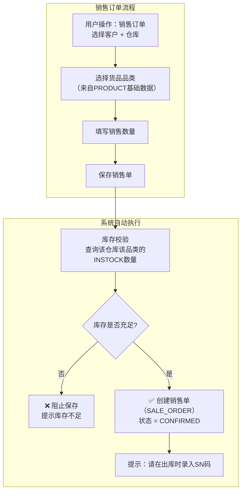

### 4.2 销售出库

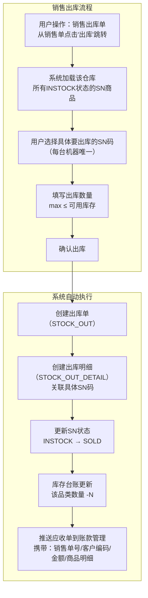

### 4.3 账款管理联动（ERP ↔ 账款管理）

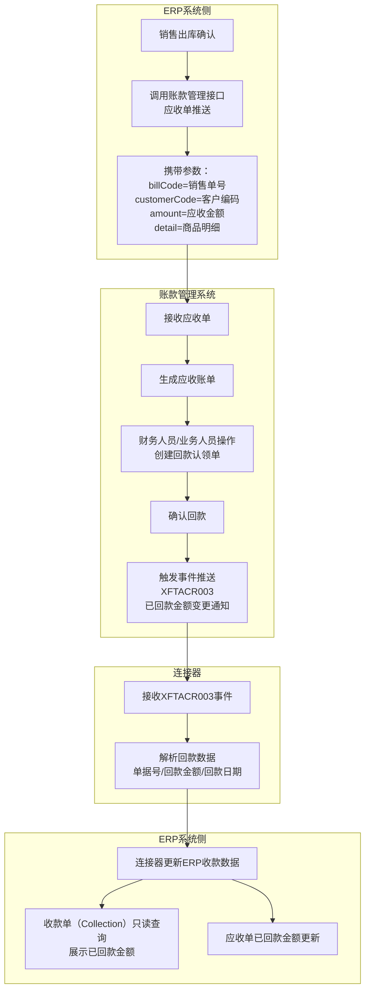

### 4.4 销售退货

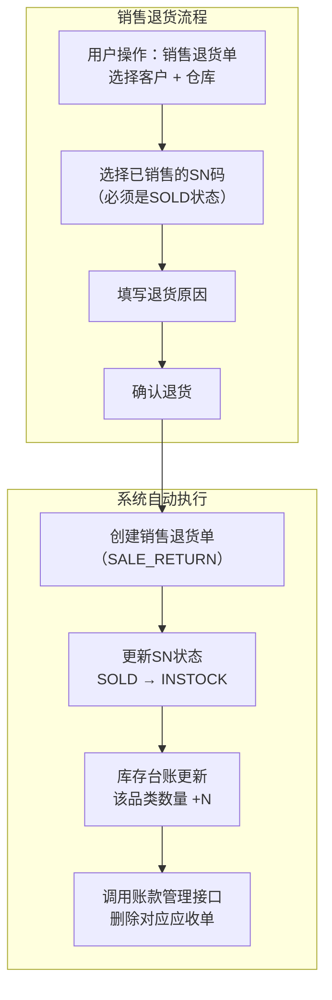

---

## 五、仓库管理流程

### 5.1 库存台账（实时查询）

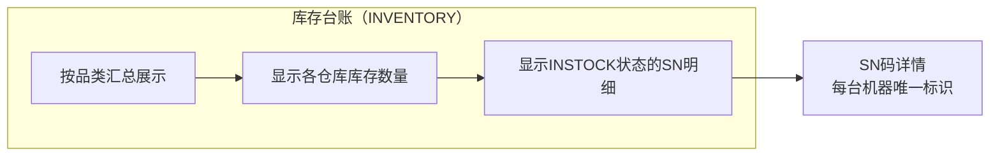

### 5.2 调拨单（SN级调拨）

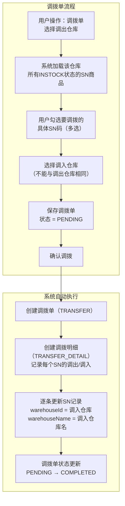

### 5.3 盘点单（SN级盘点）

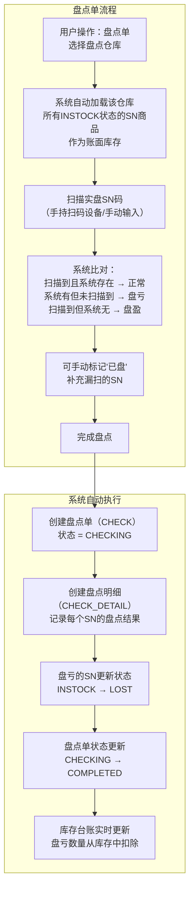

---

## 六、移动端扫码作业流程

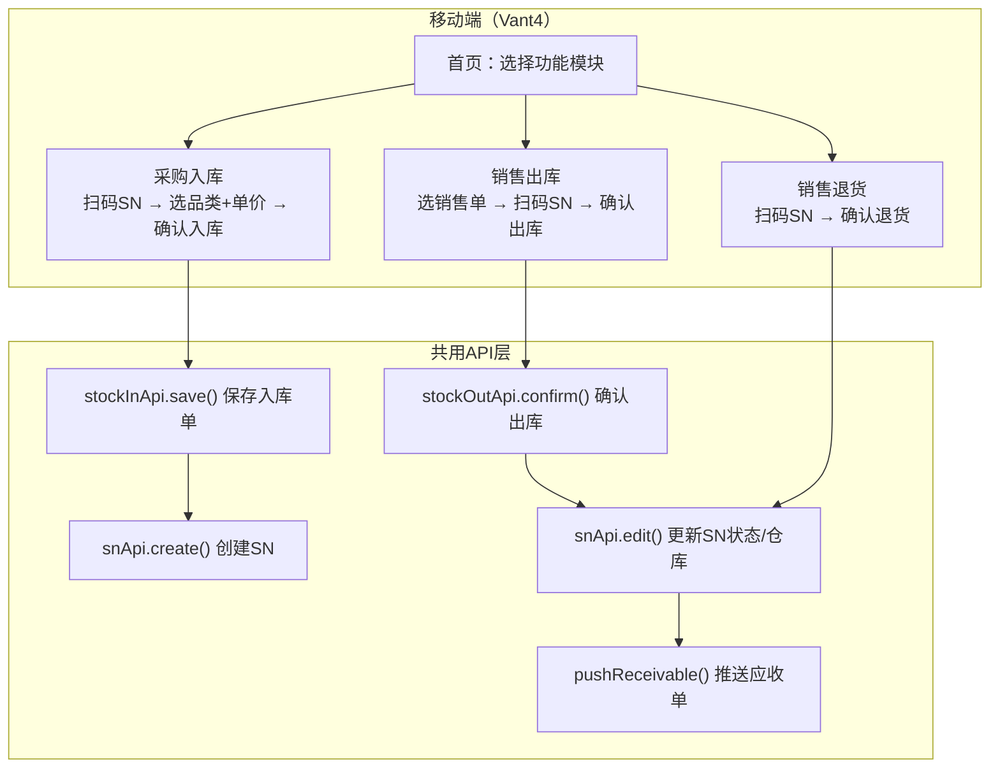

---

## 七、完整业务闭环图

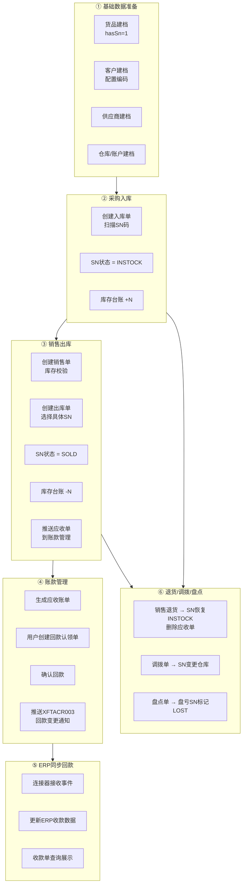

---

## 八、各模块数据模型关系

| 模块 | 主表 | 明细表 | SN关联 | 账款管理关联 |
|------|------|--------|--------|-------------|
| 采购入库 | STOCK_IN | STOCK_IN_DETAIL | SN_CODE（创建INSTOCK） | 无 |
| 采购付款 | PAYMENT | - | 无 | 无 |
| 销售订单 | SALE_ORDER | SALE_ORDER_DETAIL | 无（出库时才关联） | 无 |
| 销售出库 | STOCK_OUT | STOCK_OUT_DETAIL | SN_CODE（更新SOLD） | 推送应收单 |
| 销售退货 | SALE_RETURN | SALE_RETURN_DETAIL | SN_CODE（恢复INSTOCK） | 删除应收单 |
| 调拨单 | TRANSFER | TRANSFER_DETAIL | SN_CODE（变更仓库） | 无 |
| 盘点单 | CHECK | CHECK_DETAIL | SN_CODE（更新LOST） | 无 |
| 库存台账 | INVENTORY | - | SN_CODE（实时统计） | 无 |
| 财务流水 | FINANCE | - | 无 | 连接器同步回款 |
