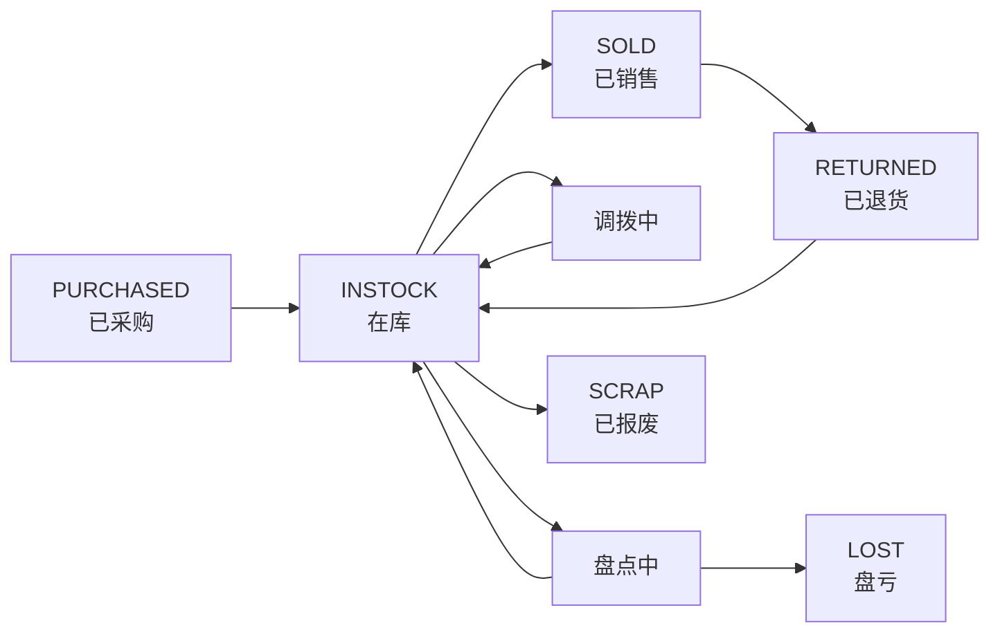

# SN码全生命周期

## 状态机

## 状态定义

| 状态 | 值 | 说明 |
|------|-----|------|
| 在库 | `INSTOCK` | 正常在仓库中 |
| 已售 | `SOLD` | 销售出库后 |
| 已退货 | `RETURNED` | 销售退货回库后 |
| 已丢失 | `LOST` | 盘点确认盘亏后 |
| 已报废 | `SCRAP` | 手动报废后 |
| 待处理 | `PENDING` | 异常待处理 |

## 关键操作及状态变更

| 操作 | 变更前 | 变更后 |
|------|-------|-------|
| 采购入库 | 无(PURCHASED) | INSTOCK |
| 销售出库 | INSTOCK | SOLD |
| 销售退货 | SOLD | RETURNED |
| 退货入库 | RETURNED | INSTOCK |
| 调拨确认 | INSTOCK | INSTOCK(仓库变更) |
| 盘点确认(盘亏) | INSTOCK | LOST |
| 报废 | INSTOCK | SCRAP |

## 相关笔记

- [[采购入库流程]]
- [[销售出库流程]]
- [[库存管理]]
- [[../项目架构/模型速查]] — MOk2ZJ4aga SN码表
