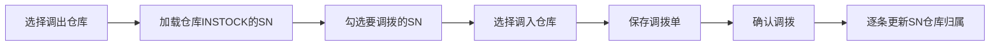
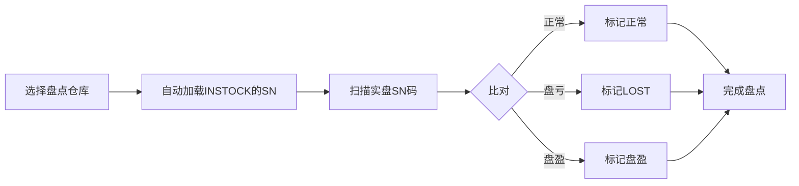

# 库存管理

## 调拨流程

### 关键点
- **SN级调拨**（非品类级）：勾选具体SN
- 确认后逐条更新每个SN的 `warehouseId` 和 `warehouseName`
- 涉及模型: 调拨单 (MOIrlRmiFH) + SN码 (MOk2ZJ4aga)

## 盘点流程

### 关键点
- 选择仓库 -> 自动加载 INSTOCK 的SN列表
- 扫描实盘SN -> 系统比对
- 盘亏SN: 自动标记为 LOST
- 盘盈SN: 记录额外信息

## 库存台账

- 模型: 库存台账 (MOsWdYRJhQ)
- 提供低库存预警 (`getLowStockCount`)
- 仓库汇总 (`getWarehouseSummary`)
- 预警列表 (`getAlertList`)

## 相关笔记

- [[SN全生命周期]]
- [[采购入库流程]]
- [[销售出库流程]]

## 参考

- [[../../docs/MODEL_REFERENCE|MODEL_REFERENCE.md]] — 完整字段定义和SQL
