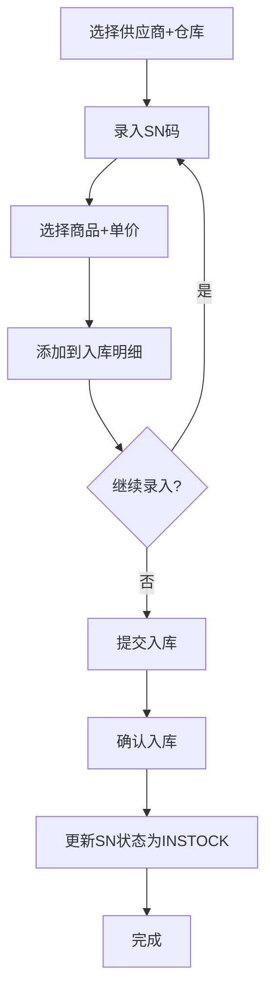

# 采购入库流程

## 流程图

## 涉及模型

- [[../项目架构/模型速查#采购入库单主表|采购入库单 (MOIN9eD2au)]]
- [[../项目架构/模型速查#采购入库单明细表|采购入库明细 (MOc2tEbUGK)]]
- [[../项目架构/模型速查#SN码表|SN码 (MOk2ZJ4aga)]]
- [[../项目架构/模型速查#供应商表|供应商 (MOmke9xgeH)]]
- [[../项目架构/模型速查#仓库|仓库 (MO3LPiTHMU)]]
- [[../项目架构/模型速查#商品|商品 (MOeUIsmD4j)]]

## 关键步骤

### 1. 录入SN码
- 扫码枪或手动输入SN码
- 选择对应商品和入库单价
- 可连续录入多条

### 2. 提交入库
- 创建入库单 (add)
- 批量更新SN码状态为 INSTOCK
- 设置仓库归属

### 3. 确认入库
- 更新入库单状态为 CONFIRMED
- 可推送应付单（账款管理）

## 相关笔记

- [[SN全生命周期]]
- [[../项目架构/模型速查]]
- [[../低开平台/模型方法运行]]

## 参考

- [[../../docs/MODEL_REFERENCE|MODEL_REFERENCE.md]] — 完整字段定义和SQL
