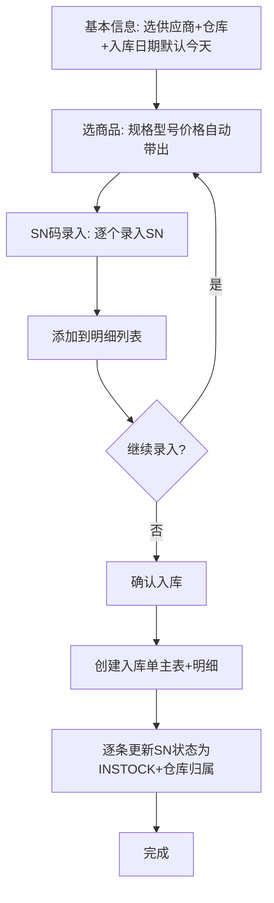

# 采购入库流程

## PC端实际流程

> [!note] 当前实现要点
> - 选商品后单价/规格/型号通过 `purchasePrice` 自动带出
> - 入库日期默认当天 (`new Date()`)
> - 确认入库后生成入库单号、记录入库日期/数量/供应商/创建时间
> - 入库时间通过 `stockInTime` 字段记录

## 涉及模型

- [[../项目架构/模型速查#采购入库单主表|采购入库单 (MOIN9eD2au)]]
- [[../项目架构/模型速查#采购入库单明细表|采购入库明细 (MOc2tEbUGK)]]
- [[../项目架构/模型速查#SN码表|SN码 (MOk2ZJ4aga)]]
- [[../项目架构/模型速查#供应商表|供应商 (MOmke9xgeH)]]
- [[../项目架构/模型速查#仓库|仓库 (MO3LPiTHMU)]]
- [[../项目架构/模型速查#商品|商品 (MOeUIsmD4j)]]

## 关键步骤

### 1. 基本信息
- 选择供应商（从账款管理同步）
- 选择仓库
- 入库日期默认今天

### 2. 选择商品
- 从商品列表中选择
- 规格、型号、采购单价（税前金额）自动带出

### 3. SN码录入
- 扫码枪或手动输入SN码，逐个录入
- 也可粘贴多行SN批量导入

### 4. 确认入库
- 创建入库单主表 (stockInApi.add)
- 创建入库单明细 (stockInDetailApi.add)
- 逐条更新SN状态为 INSTOCK，设置仓库归属
- 可推送应付单到账款管理

## 相关笔记

- [[SN全生命周期]]
- [[../项目架构/模型速查]]
- [[../低开平台/模型方法运行]]

## 参考

- [[../../docs/MODEL_REFERENCE|MODEL_REFERENCE.md]] — 完整字段定义和SQL
