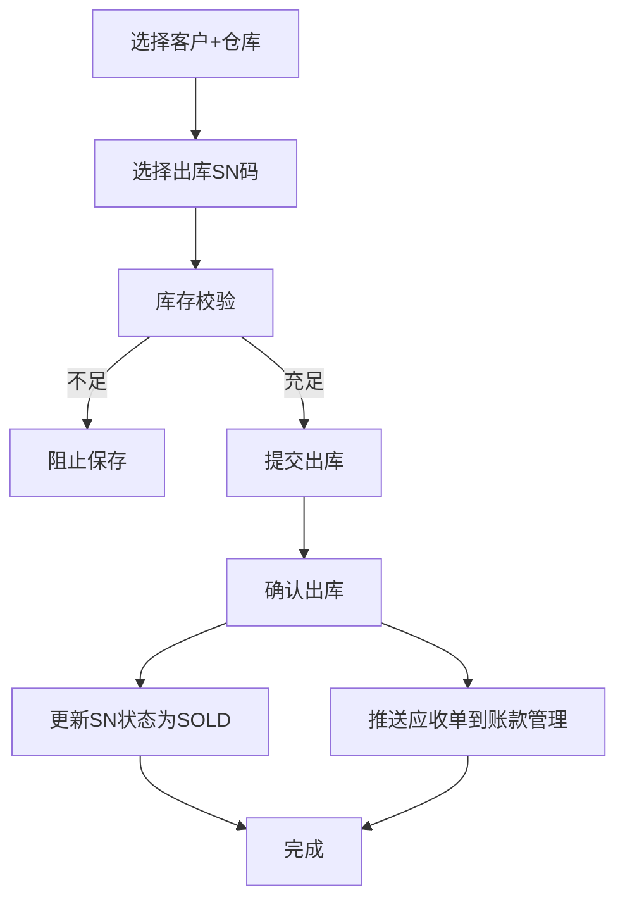

# 销售出库流程

## 流程图

## 涉及模型

- [[../项目架构/模型速查#销售出库单主表|销售出库单 (MOenA360T5)]]
- [[../项目架构/模型速查#销售出库单明细表|销售出库明细 (MOg8t6pKm4)]]
- [[../项目架构/模型速查#SN码表|SN码 (MOk2ZJ4aga)]]
- [[../项目架构/模型速查#客户|客户 (MOj7UPuJx2)]]

## 关键步骤

### 1. 选择出库SN码
- 从库存中选择 INSTOCK 状态的SN
- 按仓库过滤可用SN
- 库存校验：所选品类库存 >= 销售数量

### 2. 确认出库
- SN状态: INSTOCK -> SOLD
- 推送应收单到账款管理模块

### 3. 应收单推送
- 调用 `xftacrreceiptbillreceiptbillpush`
- 传递客户编码、商品明细、金额
- 需要 `FINANCE_FORM_CODE` 配置

## 销售单状态

| 状态 | 值 | 说明 |
|------|-----|------|
| 草稿 | `DRAFT` | 新建未确认 |
| 已确认 | `CONFIRMED` | 确认但未出库 |
| 已出库 | `OUT_STOCK` | SN已出库，待收款 |
| 已收款 | `PAID` | 回款到账 |

## 相关笔记

- [[SN全生命周期]]
- [[../账款管理/应收单推送API]]
- [[../账款管理/ERP对接流程]]

## 参考

- [[../../docs/MODEL_REFERENCE|MODEL_REFERENCE.md]] — 完整字段定义和SQL
