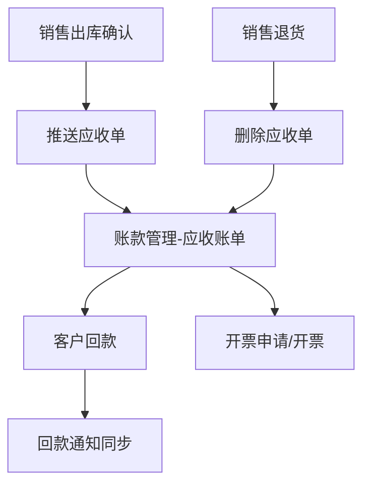

# ERP 账款管理对接流程

## 整体流程

## 触发时机

| 业务操作 | 账款操作 | 接口 |
|---------|---------|------|
| 销售出库确认 | 推送应收单 | `xftacrreceiptbillreceiptbillpush` |
| 销售退货 | 删除应收单 | `tacrreceiptbillreceiptbilldelete` |

## 回款同步

> [!note] 回款通知事件
> 账款管理事件 `XFTACR003`（单据已回款金额变更通知）
> 通过用户自建连接器同步回款数据到 ERP 财务流水表。

## 当前配置状态

- `FINANCE_FORM_CODE`: `''` — **待配置**
- 需在薪福通后台获取表单编码后填入 `src/api/index.js`

## 收款单策略

> [!important]
> ERP 端收款单改为**只读**，移除新增/删除按钮
> 提示 "正式回款请在账款管理中操作"
> 回款数据通过事件通知同步

## 相关笔记

- [[应收单推送API]]
- [[应收单删除API]]
- [[产品介绍]]
- [[常见问题]]
