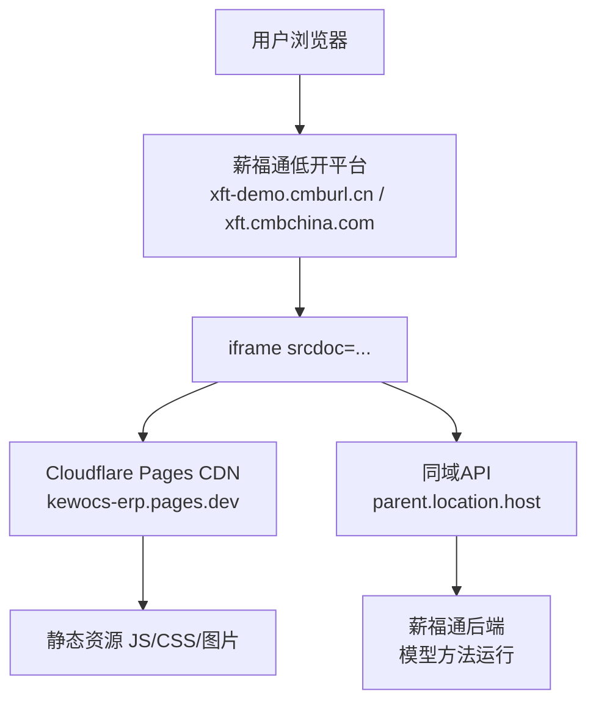

---
title: "部署架构"
tags: [架构, Cloudflare, 薪福通, iframe]
---

# 部署架构

## 运行模式



## 关键理解

> [!important] 嵌入模式
> 前端代码部署在 Cloudflare，运行时嵌入薪福通域名下。
> API 请求发往薪福通同域，Cookie 自动携带（`credentials: include`），**无需跨域代理**。

## 环境判断

```javascript
const host = parent.location.host
const isUat = host.includes("demo") || host.includes("uat")
const envTag = isUat ? "uat" : "prd"
```

## 路由方案

不使用 Vue Router，使用 Hash 路由（`about:srcdoc` 下 History API 不可用）：

```javascript
const routes = [
  { path: "/", component: Dashboard },
  { path: "/sn/list", component: SnList },
]
window.addEventListener("hashchange", () => {
  currentRoute.value = location.hash.slice(1) || "/"
})
```

## 构建部署

- **平台**: Cloudflare Pages
- **包管理**: pnpm
- **构建命令**: `pnpm run build` (vite build)
- **自动部署**: GitHub push → Cloudflare 自动拉取构建

> [!warning] 注意事项
> - 所有 .vue 文件必须 UTF-8 编码，否则 Linux 构建环境解析失败
> - `import()` 路径必须使用 Vite 别名 `@/api` 而非 `/@api`
